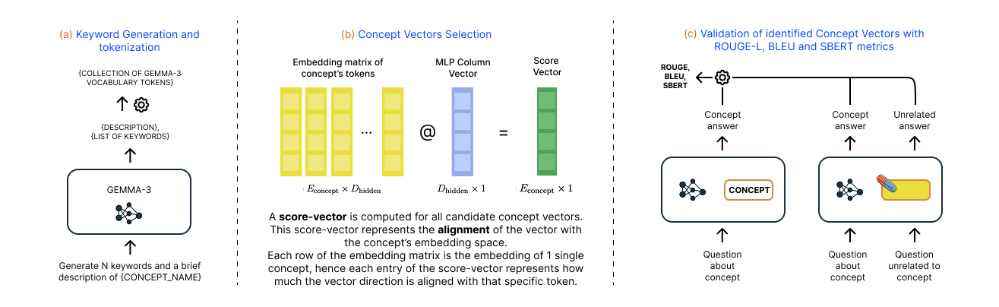

# Concept Vectors in Gemma-3 1B 🔬
## Overview

This project investigates concept vector discovery in Google's Gemma-3 1B model, inspired by the methodology from [ConceptVectors](https://github.com/yihuaihong/ConceptVectors). We extract and validate concept representations by:

1. **Extracting candidate vectors** from MLP down-projection layers
2. **Projecting vectors** onto vocabulary embeddings to find concept-specific activations
3. **Validating concepts** through causal intervention experiments using noise injection

The goal is to identify vectors formed by parameters in the model's MLP layers that promote the activation of sets of words representing interpretable concepts like "Harry Potter", "Nanomaterials", or "Blockchain".



Note: the python executables in this repository configure a local Hugging Face cache and expect a personal Hugging Face token available in the environment (HF_TOKEN). 

## Automated Pipeline Summary 🔁

Quick summary of the pipeline:
- 🔑 Generate keywords for chosen concepts and match them to vocabulary tokens.
- 📐 Extract column vectors from MLP down-projection layers and token embeddings from Gemma-3 output embedding matrix.
- 📊 Project those vectors to the token embedding matrix and rank them based on how well they align with the target concept embeddings.
- ✅ Validate candidate directions with causal interventions (noise injection) and targeted QA/adversarial tests.
- ⚠️ Perform adversarial testing using crafted jailbreak prompts (not included in the automated pipeline).

# Experimental Setup
## Minimum setup ⚙️
1. Create a Python environment and install dependencies:
```bash
pip install -r requirements.txt
```
2. Export Hugging Face token (required for model downloads):
```bash
export HF_TOKEN=your_token_here
```

## Run the full pipeline ▶️
```bash
python code/run_complete_pipeline.py
```
This runs the end-to-end flow (token generation → projection → ranking → validation). Use `--help` on the script for options.

## Individual phases workflow and How to run them
- **Token generation**:
    The script `code/token-gen/test_generation.py` calls the main generation function from `code/token-gen/generate_keywords.py` and validates output by calling `code/token-gen/validate_keywords.py`. The concepts to be tested are defined in `code/token-gen/test_concepts.json` and results are stored in `code/token-gen/token-results`.
   - Example:
      ```bash
      python code/token-gen/test_generation.py
      ```
- **Projection and ranking**:
   The script `code/projection/run_pipeline.py` calls the helper scripts `code/projection/extract_candidate_vectors.py` to extract and store column vectors from Gemma-3-1b MLP Layers, `code/projection/extract_token_embeddings.py` to extract the embeddings of the tokens of all concepts and finally `code/projection/project_and_rank_gpu_final.py` to project vectors onto concept embeddings and rank them.
   - Example (GPU recommended for large vocabularies):
      ```bash
      python code/projection/run_pipeline.py
      ```
- **Validation**:
   First run `code/concept-val-test/generate-qa-baseline.py` to generate QA pairs for all concepts. Questions are generated using a more capable model, answers are generated using gemma-3-1b to provide a baseline for validation.
   Once `qa-generated.json` is created, you can run `code/concept-val-test/ensemble_concept_validation_layerwise.py` that tests 27 different configurations of concept vetors (the number and type of configs is easily modifiable) for each concept.
   - Example:
      ```bash
      python code/cocept-val-test/generate-qa-baseline.py
      python code/concept-val-test/ensemble_concept_validation_layerwise.py
      ```
- **Adversarial / jailbreak testing**:
   Two scritps are provided for adversarial testing: `code/jailbreak-test/run_jailbreak_test.py`, that uses same questions as in validation phase to test *best concepts*, and `code/jailbreak-test/ask_adhoc_question.py` in which you can specify one of the *best concpets*  and the question you want to ask via 2 hyperparameter inside the script itself.
   
   **NOTE**: After validation, manually select the validation result .json files of the best concepts and place them inside the folder `code/concept-val-test/best-tests`, this is the folder that adversarial testing scripts use as input.
   - Example:
      ```bash
      python code/jailbreak-test/run_jailbreak_test.py 
      # Or
      python code/jailbreak-test/run_adhoc_test.py
      ```

## Plotting and analysis 📊
- Plot utilities live in `code/concept-val-test/` and include `plot_validation_results.py`, `plot_batch.py`, `plot_3d_specificities.py`, `analyze_summary_tables.py`.

## Project structure (main executables shown)
```
code/
├─ run_complete_pipeline.py
├─ projection/
│  ├─ run_pipeline.py
│  ├─ extract_candidate_vectors.py
│  ├─ project_and_rank_gpu_final.py
│  └─ ...
├─ concept-val-test/
│  ├─ ensemble_concept_validation_layerwise.py
│  ├─ advanced_concept_validation.py
│  ├─ generate-qa-baseline.py
│  ├─ plot_validation_results.py
│  └─ plot_batch.py
├─ jailbreak-test/
│  ├─ run_jailbreak_test.py
│  └─ ask_adhoc_question.py
└─ token-gen/
   ├─ generate_keywords.py
   ├─ validate_keywords.py
   └─ test_generation.py

```

## Notes 💡
- Use `--help` on each script for available flags and paths.