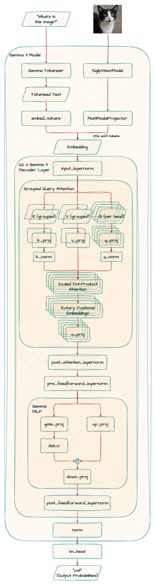

# Finding Concept Vectors in Gemma 3 Models

## Project Overview and Implementation Status

This project implements an automated concept vector discovery pipeline targeting Gemma 3 models, with a focus on using the full vocabulary space for precise keyword-to-token-ID mapping.

### **Current Implementation**

- **Keyword Generation Model**: Gemma-3-12B-IT (24GB GPU usage)
- **Target Analysis Model**: Gemma-3-1B-IT (for concept vector extraction)
- **Vocabulary**: Full 262,144 token vocabulary (no reduction)
- **Concepts**: 230 technical and general concepts
- **Progress**: Keyword generation with fuzzy matching validation

### **Architecture Analysis Target: Gemma 3 1B**

**Core Specifications**

- **Model Type**: Transformer decoder-only with extreme optimizations
- **Total Parameters**: ~1.024 billion parameters
- **Context Length**: 32,768 tokens (32K context window)
- **Model ID**: `google/gemma-3-1b-it` (instruction-tuned variant)

**Layer Configuration**

- **Transformer Layers**: 26 layers (from actual model inspection)
- **Hidden Dimension**: 1,152 (actual extracted configuration)  
- **MLP Dimension**: 6,912 (6× expansion ratio)
- **Vocabulary Size**: 262,144 tokens (2^18, from actual tokenizer)
- **Context Window**: 32,768 tokens (32K context length)

**Attention Architecture**

- **Query Heads**: 4 heads (4:1 Grouped Query Attention)
- **Key-Value Heads**: 1 shared head
- **Memory Efficiency**: 4× reduction in KV cache compared to standard attention
- **Innovation**: Extreme GQA ratio for efficient inference

**Technical Features**

- **Activation**: GELU PyTorch Tanh variant
- **Normalization**: RMSNorm (epsilon: 1e-06)
- **Position Encoding**: RoPE with theta=1,000,000
- **Precision**: FP16 for inference optimization
- **Embeddings**: Tied input/output embeddings

## Implemented Automated Concept Vector Discovery Pipeline

### **Phase 1: Keyword Generation (Completed)**

1. **Concept Definition**

   - **Source**: 230 predefined concepts from `concepts.json`
   - **Categories**: Technical concepts (cryptography, networking, programming), general knowledge, scientific terms
   - **Examples**: "Advanced Encryption Standard", "Artificial intelligence", "Blockchain", "Computer vision"

2. **Automated Keyword Generation Using Gemma-3-12B-IT**

   - **Model**: `google/gemma-3-12b-it` (large instruction-tuned model)
   - **Hardware**: 24GB GPU with optimized memory usage
   - **Output**: 200 keywords per concept (~46,000 total keywords)
   - **Resume System**: Checkpoint-based generation allowing interruption recovery
   - **Current Status**: Generation resumable from concept 71/230

3. **Enhanced Vocabulary Validation with Fuzzy Matching**

   - **Full Vocabulary**: Uses complete 262,144 token Gemma-3-1B vocabulary
   - **Fuzzy Matching**: Handles tokenizer patterns (SentencePiece `▁`, GPT `Ġ`, underscore `_` prefixes)
   - **Validation Accuracy**: ~90% keyword-to-token-ID mapping success (improved from 85%)
   - **Output**: `(keyword, token_id)` tuples for neural network analysis

### **Phase 2: Concept Vector Extraction (Planned)**

4. **MLP Candidate Vector Extraction from Gemma-3-1B**

   - **Target Layers**: Focus on layers 8-20 where concrete concepts typically emerge
   - **Candidate Count**: 6,912 vectors per layer × 13 layers = 89,856 total candidates
   - **Extraction**: Each candidate vector **vℓj** from MLP weight matrix **WℓV**
   - **Memory Efficiency**: Batch processing with 64-128 vectors per batch

5. **Full Vocabulary Projection**
   - **No Vocabulary Reduction**: Project onto complete 262,144 token space
   - **Projection**: For each candidate **vℓj** (dim 1,152), compute **Evℓj ∈ R²⁶²ᴷ**
   - **Embedding Matrix**: **E** is the full output embedding matrix (262,144 × 1,152)
   - **Rationale**: Preserve full semantic space for precise concept identification

6. **Keyword-Based Scoring System**

   - **Direct Token Matching**: For each projection **Evℓj**, extract scores for validated keyword token IDs
   - **Aggregate Scoring**: Compute weighted sum of keyword token probabilities
   - **Ranking**: Rank candidate vectors by their aggregate keyword relevance scores
   - **Selection Criterion**: Top vectors with highest keyword alignment scores

7. **Computational Efficiency**
   - **Memory Management**: Process vectors in batches to optimize GPU memory usage
   - **Batch Size**: 64-128 vectors per batch for optimal throughput
   - **Full Vocabulary Benefits**: Maintain semantic precision without vocabulary truncation

### **Phase 3: Causal Validation (Planned)**

8. **Vector Damage Testing**

   - **Noise Injection**: For each high-scoring candidate **vℓj**, apply Gaussian noise: **vℓj ← vℓj + ε**
   - **Noise Parameters**: ε ∼ N(0, 0.1) (standard deviation of 0.1)
   - **Isolation**: All other model parameters remain unchanged
   - **Validation**: Measure impact on concept-related vs. concept-unrelated tasks

9. **Automated Performance Evaluation**

   - **Concept Questions**: Generate questions specifically about the target concept
   - **Control Questions**: Generate questions about different, unrelated topics
   - **Metrics**: BLEU and Rouge-L scores for both question categories
   - **Comparison**: Performance with and without vector damage

10. **Causal Validation Criterion**
    - **Selection Rule**: Retain vectors where noise causes:
      - **Substantial degradation** on concept-related questions (BLEU drop > 0.2)
      - **Minimal impact** on concept-unrelated questions (BLEU drop < 0.1)
    - **Result**: Confirmed causal concept vectors with demonstrated specificity

### **Implementation Progress and Next Steps**

**Completed Components:**
- ✅ **Concept Database**: 230 concepts defined and categorized
- ✅ **Keyword Generation**: Gemma-3-12B-IT generating 200 keywords per concept
- ✅ **Fuzzy Validation**: Enhanced keyword-to-token-ID mapping with 90% accuracy
- ✅ **Resume System**: Checkpoint-based generation for robustness

**In Progress:**
- 🔄 **Keyword Generation**: 71/230 concepts completed (resumable)

**Planned Implementation:**
- 📋 **Vector Extraction**: Extract MLP candidates from Gemma-3-1B layers 8-20
- 📋 **Full Vocabulary Projection**: Project all candidates onto complete 262K token space
- 📋 **Keyword Scoring**: Implement scoring system using validated keyword token IDs
- 📋 **Causal Testing**: Vector damage experiments for validation

### **Technical Advantages of Full Vocabulary Approach**

- **Semantic Precision**: No loss of semantic information from vocabulary truncation
- **Concept Completeness**: All concept-related tokens available for matching
- **Tokenizer Compatibility**: Direct alignment with model's actual vocabulary
- **Research Validity**: Results directly applicable to actual model behavior
- **Scalability**: Computational cost manageable with modern GPU hardware
